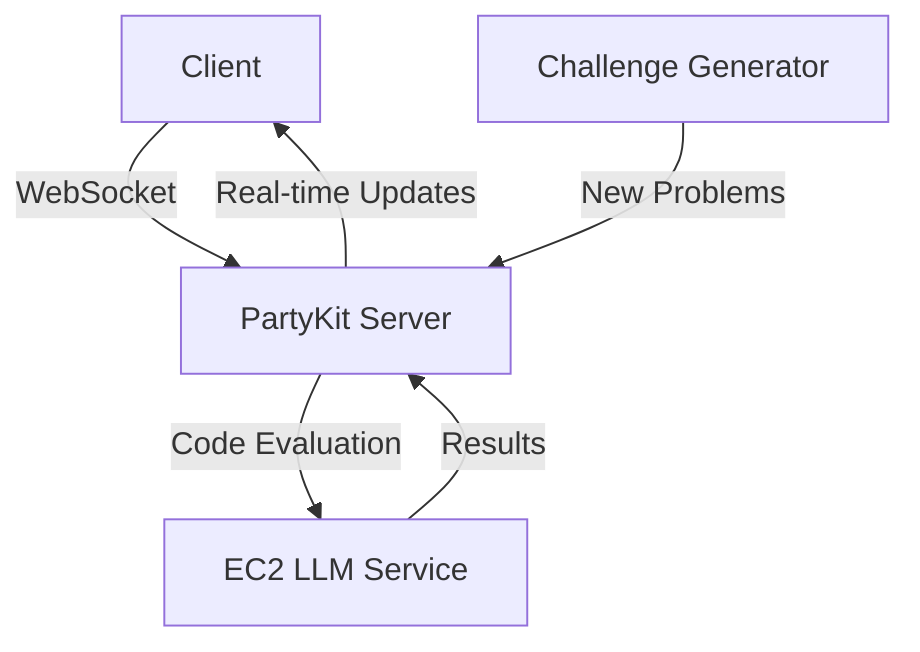

## Code Clash 🚀

### Growth Through Gamified Learning 🌱

### Inspiration 💡
Traditional coding education platforms follow a solitary, linear path. But what if learning to code could feel like playing your favorite multiplayer game? Code Clash was born from a simple observation: people learn faster when they're having fun and competing with friends. By turning coding challenges into real-time battles, we're not just teaching code – we're cultivating a growth mindset.

### Originality & Innovation 🎯
While coding platforms exist, Code Clash stands out through:

- 🎮 Industry-first real-time multiplayer coding battles
- 🤖 AI-powered dynamic feedback
- 🔄 Instant code evaluation with peer learning
- 🌟 Skill-based matchmaking for balanced competition
- 💫 Interactive code visualization for beginners

### Theme: Growth in Action 🌱
We embodied "Growth" across multiple dimensions:

- **Personal Growth:** Progressive skill development from basics to advanced
- **Community Growth:** Peer-to-peer learning and mentorship
- **Technical Growth:** Real-time feedback and improvement metrics
- **Accessibility Growth:** Breaking down barriers to coding education
- **Platform Growth:** Scalable architecture for expanding user base

### Technical Excellence 💻
Our tech stack pushes boundaries:

- ⚡ Next.js & TypeScript: Enterprise-grade foundation
- 🎨 Tailwind & Framer Motion: Polished, animated UI/UX
- 🔗 PartyKit: Cutting-edge real-time multiplayer infrastructure
- 🧠 Custom LLM Integration: Advanced code analysis self-hosted on Amazon EC2
- 📊 WebSocket Protocol: Sub-100ms latency for real-time battles

### Development Journey & Learning 📚
Our team stretched beyond comfort zones:

- First time writing in Typescript let alone implementing real-time multiplayer systems
- Learned PartyKit from documentation to deployment in 24 hours
- Mastered WebSocket optimization for minimal latency
- Developed custom LLM prompts for code evaluation
- Created responsive animations with Framer Motion
- Discovered how to implement EC2 cloud storage and MongoDB Atlas

### Design & User Experience 🎨
We prioritized intuitive design:

- 🎯 Clean, distraction-free coding interface
- 📱 Responsive design for all devices
- 🌈 Engaging animations that guide users
- 🎮 Game-like elements that maintain focus
- 👥 Inclusive design for all skill levels

### Working Prototype Achievements 🏆
In 24 hours, we delivered:

- ✅ Fully functional multiplayer system
- ✅ Real-time code evaluation
- ✅ Dynamic challenge generation
- ✅ User authentication and profiles
- ✅ Cross-browser compatibility

### Technical Challenges Conquered 💪
- **Multiplayer Synchronization:** Solved using custom PartyKit implementation
- **Real-time Evaluation:** Optimized LLM processing for instant feedback
- **Scalability:** Implemented efficient WebSocket management
- **Security:** Built secure code execution environment
- **Performance:** Achieved consistent sub-100ms latency

### What's Next 🎯
Future technical expansions:

- 🏗️ WebAssembly integration for browser-based code compilation
- 🤖 Advanced AI curriculum adaptation
- 📊 Enhanced analytics dashboard
- 🌐 Global tournament infrastructure
- 📱 Native mobile applications

### Technical Architecture 🏗️

Built with determination in 24 hours by a team passionate about democratizing coding education 💖

**Technologies:** TypeScript, Next.js, Tailwind CSS, Framer Motion, PartyKit, Amazon EC2 ⚡
